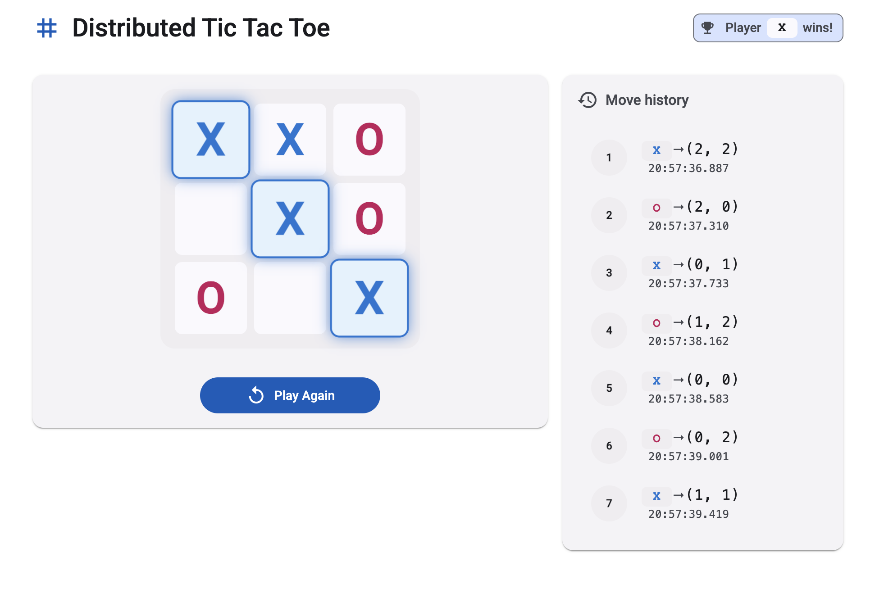
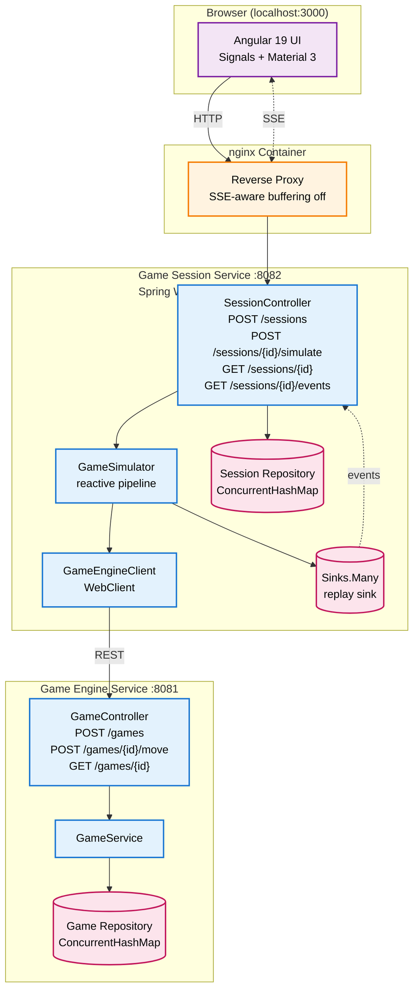

# Distributed Tic Tac Toe

> Microservices-based Tic Tac Toe where the game plays itself.

<p align="center">
  
</p>

## Overview

This project implements a self-playing Tic Tac Toe system across three loosely coupled components: a Game Engine Service that enforces rules and manages board state, a Game Session Service that orchestrates simulation runs and streams move-by-move progress to clients, and an Angular UI that connects to the session service and renders the game in real time via Server-Sent Events. The Engine exposes a plain REST API; the Session service is fully reactive (Spring WebFlux + Reactor); the UI uses Angular 19 Signals for state management. The goal is to demonstrate thoughtful backend design across a realistic distributed system — not just a working app, but one with intentional service boundaries, production-grade error handling, and an honest set of trade-offs documented.

## Architecture



> Solid arrows: REST/HTTP. Dotted arrows: SSE event streaming. Cylinders: data stores.

The user clicks **Start simulation** in the UI. The UI calls `POST /sessions/{id}/simulate`, which returns 202 immediately. The Session service starts a reactive pipeline that drives move generation: each step calls `POST /games/{id}/move` on the Engine, receives the updated board state, emits a `MOVE_MADE` event into a replay sink, and waits 400 ms before the next move. The UI's `EventSource` connection to `GET /sessions/{id}/events` receives each event as it arrives and updates the board signal, triggering OnPush re-renders. When the Engine reports a terminal status (`X_WON`, `O_WON`, or `DRAW`), the simulator emits `GAME_FINISHED` and completes the sink.

## Tech Stack

| Component | Tech | Notes |
|---|---|---|
| Engine | Java 21, Spring Boot 3.5, Spring MVC, Tomcat | Blocking servlet stack — CPU-bound rule evaluation, no async benefit |
| Session | Java 21, Spring Boot 3.5, Spring WebFlux, Netty | Reactive — I/O-bound HTTP calls to Engine + SSE streaming |
| UI | Angular 19, Signals, Angular Material 3 (Azure/Blue) | Standalone components, OnPush, native `EventSource` |
| Build | Maven (Java modules), npm / Angular CLI (UI) | `mvn -B clean package`, `npm run build` |
| Deployment | Docker, docker compose, nginx (UI container) | Multi-stage builds, service healthchecks, SSE-safe nginx config |

## Quick Start (Docker)

Requires Docker and Docker Compose.

```bash
git clone <repo-url>
cd flamingo-tic-tac-toe
docker compose up --build
```

Docker pulls base images, compiles all three modules, and starts them in dependency order. The Engine must be healthy before the Session starts; the Session must be healthy before the UI starts (healthchecks via `/actuator/health`). Expect **60–90 seconds** for a cold build.

Open **http://localhost:3000** in a browser. Click **Start Simulation** to watch the game play itself move by move.

To stop:

```bash
docker compose down
```

## Local Development

### Game Engine Service (port 8081)

```bash
cd game-engine-service
mvn spring-boot:run
```

No external dependencies. Starts on `localhost:8081`.

### Game Session Service (port 8082)

```bash
cd game-session-service
mvn spring-boot:run
```

Requires the Engine running on `localhost:8081`. The Engine URL is configurable via `GAME_ENGINE_URL` environment variable (default: `http://localhost:8081`). Move delay between simulation steps defaults to 400 ms; override with `simulation.move-delay-ms`.

### UI (port 4200)

```bash
cd ui
npm install
npm start
```

The dev server uses `proxy.conf.json` to forward all `/sessions/*` requests to `localhost:8082`, so CORS is not an issue during local development. Open **http://localhost:4200**.

## API Reference

### Endpoints

| Method | Path | Service | Purpose | Status codes |
|---|---|---|---|---|
| `POST` | `/games` | Engine | Create a new game | 201 |
| `POST` | `/games/{id}/move` | Engine | Apply a move | 200, 400 (invalid move), 404, 409 (game finished) |
| `GET` | `/games/{id}` | Engine | Get current game state | 200, 404 |
| `POST` | `/sessions` | Session | Create a session (and a backing game) | 201, 502 (engine down) |
| `POST` | `/sessions/{id}/simulate` | Session | Start asynchronous simulation | 202, 404, 409 (already running/finished) |
| `GET` | `/sessions/{id}` | Session | Get session details and move history | 200, 404 |
| `GET` | `/sessions/{id}/events` | Session | SSE stream of simulation events | 200 (`text/event-stream`), 404 |

All error responses from both services use **RFC 7807 ProblemDetail** (`application/problem+json`) with `type`, `title`, `status`, and `detail` fields.

### Happy-path curl example

```bash
# 1. Create a session (Engine game is created automatically)
SESSION=$(curl -s -X POST http://localhost:8082/sessions | jq -r '.sessionId')

# 2. Start the simulation (returns 202 immediately)
curl -s -X POST http://localhost:8082/sessions/$SESSION/simulate

# 3. Stream events until the game finishes
curl -N -H "Accept: text/event-stream" http://localhost:8082/sessions/$SESSION/events

# 4. Poll final state
curl -s http://localhost:8082/sessions/$SESSION | jq '{status, moves: (.moves | length)}'
```

## Design Decisions

### Why Reactive (Session Service)

The Session service is built on Spring WebFlux and Reactor, not Spring MVC with virtual threads. The simulation workload is I/O-bound: each move is a short HTTP call to the Engine, followed by a 400 ms delay, followed by another HTTP call — repeated up to nine times. Between calls, the thread does nothing useful. Reactive handles this with zero blocked threads, which matters when many concurrent sessions are running. The Engine, by contrast, does CPU-bound board evaluation and win detection — no I/O to overlap — so a blocking servlet stack is simpler and equally fast there. The split is intentional: use reactive where the model fits, and don't introduce it where it adds complexity without benefit.

Virtual threads (Java 21 `Executors.newVirtualThreadPerTaskExecutor`) could handle the Session service's I/O pattern too. Reactor was chosen because it makes the simulation pipeline explicit — composable operators (`defer`, `repeat`, `takeUntil`), the replay sink for SSE, and clear backpressure semantics. Virtual threads would solve the threading problem but not give those building blocks for free.

### Server-Sent Events for Real-time Updates

SSE fits the simulation flow: events flow strictly server → client, so WebSocket's bidirectional protocol adds no value and extra complexity. SSE works over plain HTTP/1.1, which means standard nginx proxy configuration and browser `EventSource` API — no custom client code, no protocol upgrade handshakes.

The simulator uses `Sinks.many().replay().all()` as the event store for each session. This means a late subscriber (e.g., a browser refresh after simulation starts) receives the full history of events that already occurred, then continues receiving live events as they arrive. Without replay, a reconnecting client would see only future moves and miss board state built up so far. The sink completes when the game finishes, which signals the `EventSource` connection to close cleanly.

### Separation of sessionId and gameId

The Session service generates its own `sessionId` (UUID); the Engine generates its own `gameId`. The Session stores the mapping. They could have been made identical — one ID, two services. They were kept separate because: (1) each service owns its identifiers and its invariants; (2) the mapping is explicit and visible in the API; (3) future extensions like tournaments (one session spanning multiple games) or replays (multiple sessions referencing one historical game) are natural to express. The cost is a small extra field in responses. The benefit is cleaner service boundaries.

### Fire-and-forget Simulation

`POST /sessions/{id}/simulate` returns HTTP 202 Accepted immediately. The actual simulation pipeline is subscribed on `Schedulers.parallel()` and runs asynchronously — the HTTP handler thread is done before the first move is sent to the Engine. Clients track progress exclusively via the SSE stream.

The trade-off: the caller cannot `await` the simulation result on the HTTP response. In this system this is fine because clients subscribe to SSE anyway; the 202 is just acknowledgment that simulation started. The fire-and-forget model also keeps the API surface simple — no long-polling, no callback registration.

### Concurrent Simulation Guard

`Session.startSimulationIfNotStarted()` is a `synchronized` method that atomically transitions `CREATED → SIMULATING`. If the session is already in any other state, it returns `false` and the service throws either `SessionAlreadyRunningException` or `SessionAlreadyFinishedException` (→ HTTP 409). This prevents the race where two rapid `POST /simulate` calls both pass the status check before either has updated it. The guard is cheap — one synchronized method call — and eliminates an entire class of bugs that would produce duplicate simulation pipelines writing to the same sink.

### In-memory Storage

Both services use `ConcurrentHashMap`-backed in-memory repositories. The assignment permitted H2 or in-memory storage; plain `ConcurrentHashMap` was chosen because it is simpler, has no schema, and has no startup overhead. Sessions and `getMoves()` snapshots are protected by `Collections.synchronizedList` with a defensive `List.copyOf` — the simulation thread appends moves while the HTTP handler may read them concurrently.

The trade-off is durability: all data is lost on restart. For a simulation system where each game runs in seconds and no game state is worth persisting across restarts, this is acceptable. Production use would replace the repository implementation with a Postgres or Redis backend without touching service or controller code — the repository interface is the seam.

### RFC 7807 Problem Detail

Both services use Spring's `ProblemDetail` (RFC 7807) for all error responses. Every exception type maps to a consistent JSON shape with `type`, `title`, `status`, and `detail` fields. This means clients can inspect `$.title` rather than parsing free-form error strings, and monitoring systems get structured data.

### Microservices DTO Independence

The Engine and Session services define their DTOs independently. `game-session-service` has its own `client/dto/` package that mirrors the Engine's API contract — `GameStateResponse`, `MoveRequest`, `PlayerValue`, etc. A shared `common` module was deliberately avoided.

The trade-off: some duplication, and drift between the two representations is possible. The benefit: each service owns its API contract completely. Adding a field to the Engine response does not force a recompile of the Session service; removing one surfaces as a deserialization gap, not a compilation failure. The integration tests exercise the full HTTP round-trip and catch contract drift early.

### UI State Management with Angular Signals

The UI uses Angular 19 Signals (`signal`, `computed`) for state management rather than RxJS `BehaviorSubject`. Signals integrate directly with `ChangeDetectionStrategy.OnPush` — no explicit `markForCheck()` calls, no zone.js involvement for state changes. The result is less boilerplate and automatic fine-grained re-renders.

RxJS is still used at the integration boundaries: `HttpClient` (HTTP calls) and the native `EventSource` → signal bridge in `GameEventsService` (SSE events are emitted from the browser's callback API and fed into signals). Signals are for state; RxJS handles event streams at the edges.

## Testing

**Game Engine Service — 66 tests.** Domain unit tests cover `Game`, `Board`, and `Position` exhaustively including win detection, draw detection, and invalid move scenarios. Controller slice tests (`@WebMvcTest`) verify request validation, HTTP status codes, and ProblemDetail shapes for all error paths. Full `@SpringBootTest` integration tests run against the actual servlet stack.

**Game Session Service — 50 tests.** Unit tests use Mockito to isolate `SessionService`, `GameSimulator`, `SimulationContextRegistry`, `MoveGenerator`, and `GameEngineClient`. `@WebFluxTest` slice tests cover the controller's HTTP mapping. WireMock integration tests (`@SpringBootTest` with `WebEnvironment.RANDOM_PORT`) exercise the full reactive pipeline against a stubbed Engine: session creation, full simulation flow, SSE event delivery, 409 conflict on duplicate simulate, and 404 for unknown sessions. A dedicated concurrency stress test runs 1000 concurrent `recordMove` and `getMoves` calls on the same session to verify thread safety.

**UI — 4 tests.** Smoke tests verify that the root component renders and key child components are present in the DOM. SSE flow, error states, and the full simulation UX were verified manually during development. For a backend-role submission, comprehensive Angular testing (Cypress or Playwright) was considered out of scope — the UI is strongly typed with `OnPush` throughout, which catches a large class of bugs at compile time.

## Known Limitations

1. **No per-game locking in Engine.** `GameService` does not serialize concurrent move requests on the same game. The Session service serializes them implicitly — one simulation pipeline per session, sequential moves — so concurrent requests on the same game do not occur in this system. Documented in `GameService` Javadoc. Production use with multiple clients writing to the same game simultaneously would require optimistic locking or a compare-and-swap on game version.

2. **In-memory storage.** Sessions and game state are lost on service restart. See [Design Decisions](#in-memory-storage).

3. **UI tests are minimal.** 4 smoke tests cover initial render. SSE flow and error states were verified manually. See [Testing](#testing).

4. **Engine and Session DTOs not shared.** By design. See [Design Decisions](#microservices-dto-independence).

## Project Structure

```
flamingo-tic-tac-toe/
├── docker-compose.yml                  # Full-stack startup with healthchecks
├── docs/
│   └── screenshot.png                  # UI in action
├── game-engine-service/                # Spring MVC, blocking, port 8081
│   ├── src/main/java/com/flamingo/engine/
│   │   ├── domain/                     # Game, Board, Position, enums
│   │   ├── service/                    # GameService
│   │   ├── repository/                 # InMemoryGameRepository
│   │   ├── api/                        # GameController, DTOs
│   │   └── exception/                  # Domain exceptions + GlobalExceptionHandler
│   ├── src/test/java/                  # 66 tests
│   ├── Dockerfile                      # Multi-stage Maven → JRE Alpine
│   └── pom.xml
├── game-session-service/               # Spring WebFlux, reactive, port 8082
│   ├── src/main/java/com/flamingo/session/
│   │   ├── domain/                     # Session, Move, enums
│   │   ├── service/                    # SessionService, GameSimulator,
│   │   │                               #   SimulationContextRegistry, MoveGenerator
│   │   ├── repository/                 # InMemorySessionRepository
│   │   ├── client/                     # GameEngineClient (WebClient) + client DTOs
│   │   ├── api/                        # SessionController, DTOs
│   │   └── exception/                  # Domain exceptions + GlobalExceptionHandler
│   ├── src/test/java/                  # 50 tests (incl. WireMock integration)
│   ├── Dockerfile
│   └── pom.xml
└── ui/                                 # Angular 19, standalone, Signals, port 3000
    ├── src/app/
    │   ├── components/                 # game-board, game-status,
    │   │                               #   move-history, start-controls
    │   ├── services/                   # SessionService, GameEventsService
    │   ├── models/                     # Session, Move, SimulationEvent types
    │   └── app.component.{ts,html,scss}
    ├── nginx.conf                      # SSE-aware reverse proxy
    ├── proxy.conf.json                 # Dev proxy /sessions → :8082
    ├── Dockerfile                      # Multi-stage node build → nginx alpine
    └── package.json
```
